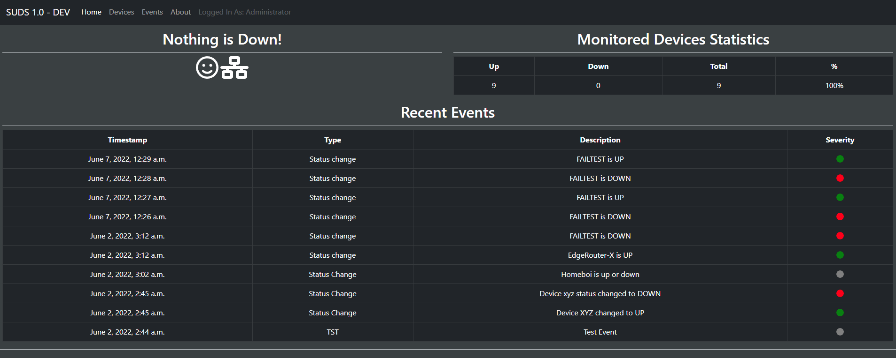
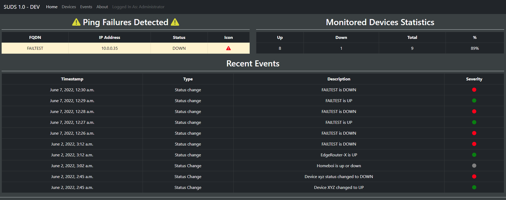
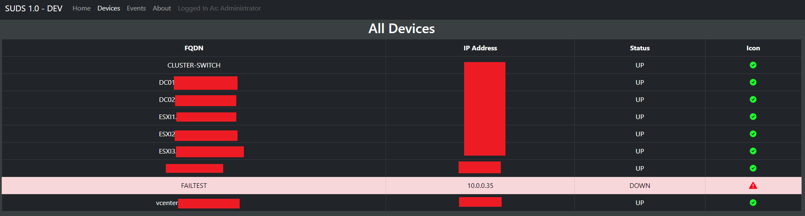
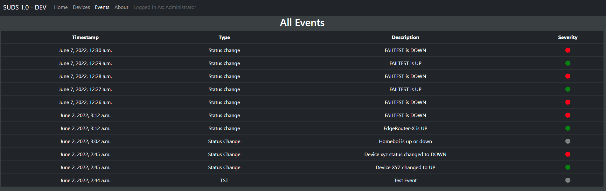
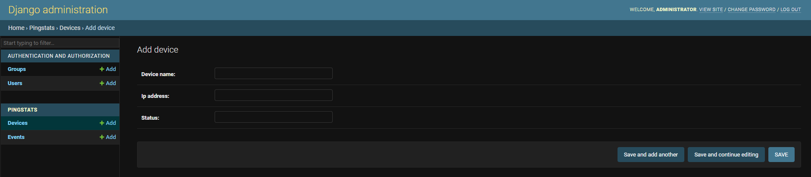

# SUDS

## SUDS? What's so great about it?
Well, I wanted to make my own monitoring tool as a fun little task.

## What the hell does SUDS mean?
SUDS = Simple Up Down Service

## Instructions
If you read the instructions, you can set it up yourself! It's not nifty by any means but it can at least tell you if something is up or down. RTFM, it's instructions.txt

Tl;dr - Do a git clone, open up two terminals, activate the virtual environment in both terminals, then run the python file inside of svc_pingparallel and in the other terminal do **py manage.py runserver 0.0.0.0:8000**

## Disclaimer
**Don't use in a production environment. The API is wide open, no username or password required. The API is also exempt from CSRF.**

## What does this project use?
1. Python 3.10, 
2. Django 4.0.4, 
3. FontAwesome (CSS), 
4. Bootstrap 5

## How does it work?
1. The webserver must be running first
2. There is a python file (svc_pypingparallel\SUDS_subservice.py) that's on an infinite loop and then sleeps for 60 seconds each time it loops.
3. It will pull all the devices, their id, and their IP address via /api/
4. Then it will ping them all at the same time because concurrent.Futures is awesome
5. The script will then pass back a patch() to the pingstats API updating each device's status on whether it is up or down
6. If the script detects that the device changed from UP to DOWN or DOWN to UP, it will also create a new event and timestamp it

## Why did I do this project?
1. I wanted to revisit my Python skills
2. I wanted a simple monitoring tool that wouldn't be a resource hog
3. I wanted to make my own ping tool.
4. I wanted to write my own API
5. The subservice uses multithreading to ping, which is cool.
6. Someday, it would be cool to be in a Devops position, I feel like this is a great first step.
7. Most of all, I wanted to be able to package and deliver a monitoring tool that can be used on any OS that is 100% free

## What is left to do?
1. Timezone Awareness and setting a proper timezone that is exclusive to the user
2. Maintenance Mode setting for devices
3. CSS Overhaul because my CSS and HTML code is gross
4. A clock would probably be useful on the front page
5. A logout button in the navbar
6. Maybe having the page auto-refresh?

## Screenshots
### /home/ - No Devices down

### /home/ - When Devices Are Down

### See All Devices at /device-list/

### See Events at /events/

### Use /admin/ to add or remove "devices" to monitor

